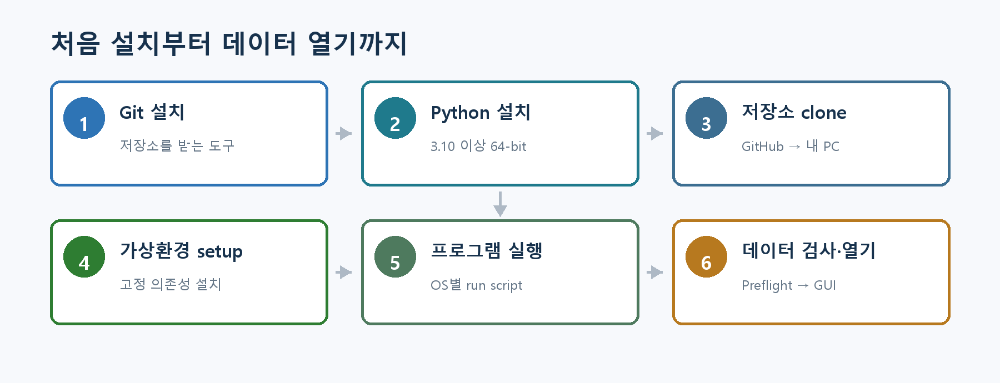
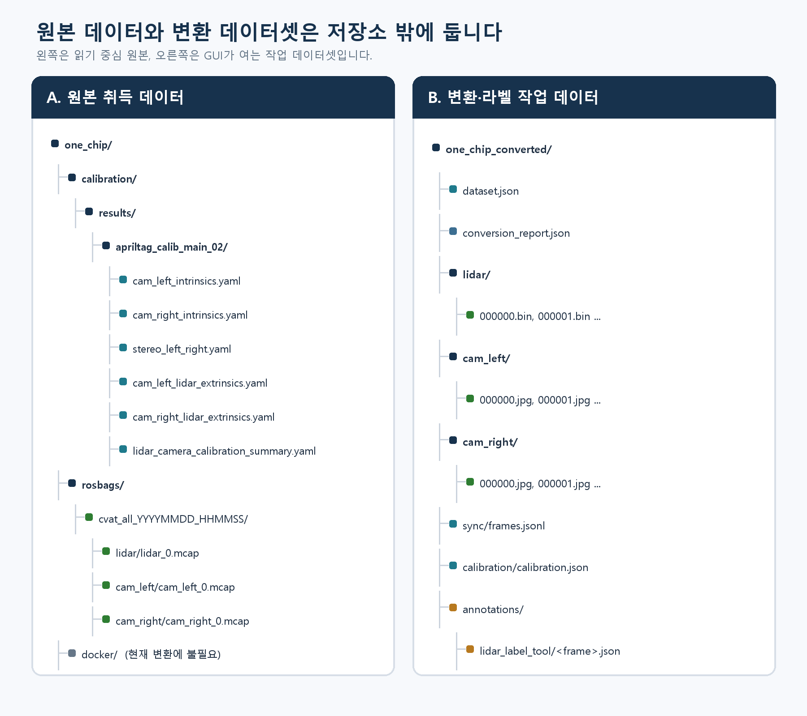
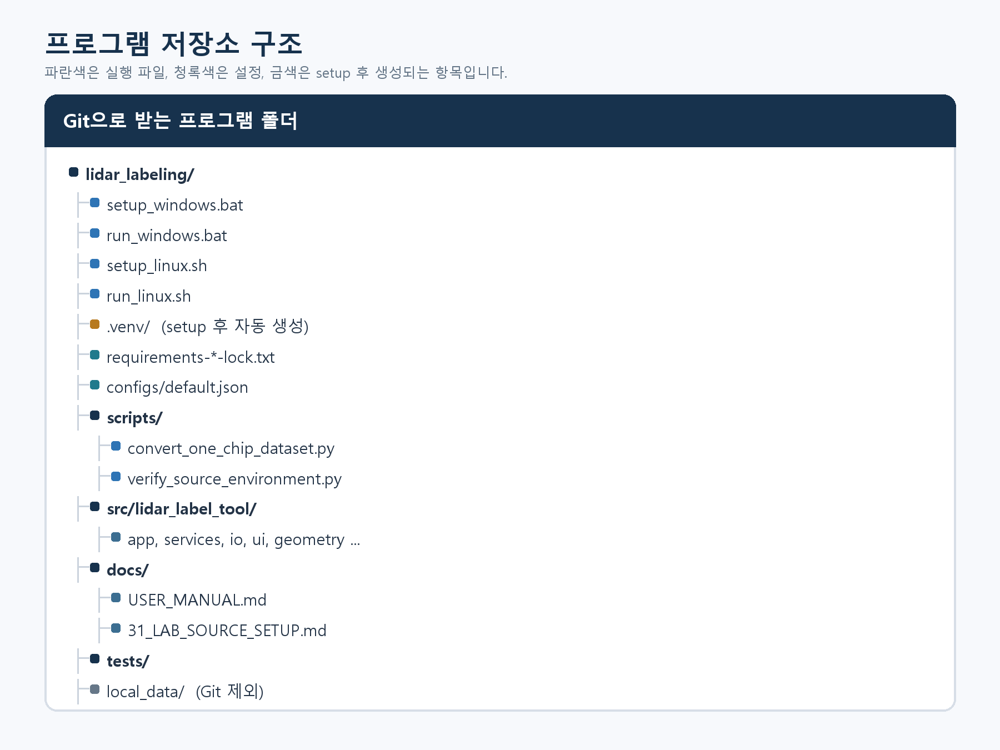

# LiDAR Label Tool

LiDAR point cloud와 좌·우 camera image를 함께 보면서 3D bounding box를 생성·수정·저장하는
실험실 내부 라벨링 도구입니다. Windows와 Linux 모두 **Python 가상환경에서 소스 실행**하는
방식을 사용합니다. 별도 EXE/ELF 설치 파일은 현재 운영 경로가 아닙니다.

> **처음 사용하는 분은 먼저 읽어 주세요.**
> [초보자 설치·실행 가이드 (Word)](docs/LIDAR_LABEL_TOOL_BEGINNER_SETUP_GUIDE_KO.docx)에는
> Git/Python 설치부터 데이터 변환, 검수, 다른 PC 인수 체크리스트까지 그림과 함께 정리되어 있습니다.



## 지원 환경

- Windows 10/11 64-bit 또는 Ubuntu 22.04+
- Python 3.10 이상 64-bit
- Git
- 정상적인 OpenGL 그래픽 드라이버와 데스크톱 화면
- 최초 package 설치용 인터넷 또는 실험실 내부 wheelhouse

원본 MCAP/YAML, 변환 데이터셋과 작업 라벨은 Git 저장소 밖에 둡니다. Git에는 프로그램 코드와
문서만 저장합니다.

## Windows에서 처음 설치

### 1. Git과 Python 설치

1. [Git for Windows](https://git-scm.com/download/win)를 설치합니다.
2. [Python for Windows](https://www.python.org/downloads/windows/)에서 Python 3.10 이상
   64-bit를 설치합니다.
3. Python 설치 화면에서 `Add python.exe to PATH`와 Python Launcher 옵션을 켭니다.
4. 새 PowerShell에서 설치를 확인합니다.

```powershell
git --version
py -3 --version
```

### 2. 저장소 내려받기

프로젝트를 둘 폴더에서 PowerShell을 열고 실행합니다.

```powershell
cd C:\Lab
git clone https://github.com/min5921/lidar_labeling.git
cd lidar_labeling
```

### 3. 가상환경 설치와 실행

```powershell
.\setup_windows.bat
.\run_windows.bat
```

`setup_windows.bat`은 `.venv`를 만들고 고정된 package를 설치한 뒤 환경을 검증합니다. 마지막에
`[OK] LiDAR Label Tool source environment verified`가 표시되어야 합니다. 이후 평상시에는
`run_windows.bat`만 실행하면 됩니다.

자동 Python 탐색이 실패하면 위치를 직접 지정합니다.

```powershell
.\setup_windows.bat -PythonCommand C:\Python310\python.exe
```

## Ubuntu Linux에서 처음 설치

```bash
sudo apt-get update
sudo apt-get install -y git python3 python3-venv \
  libegl1 libgl1 libxkbcommon-x11-0 libxcb-cursor0

mkdir -p ~/lab
cd ~/lab
git clone https://github.com/min5921/lidar_labeling.git
cd lidar_labeling

chmod +x setup_linux.sh run_linux.sh
./setup_linux.sh
./run_linux.sh
```

다른 Python을 사용하려면 다음처럼 지정합니다.

```bash
PYTHON_BIN=python3.12 ./setup_linux.sh
```

SSH만 연결된 서버에는 GUI를 표시할 데스크톱 화면이 없을 수 있습니다. 로컬 desktop session 또는
그래픽 전달이 올바르게 구성된 환경에서 실행해야 합니다.

<details>
<summary>Conda 환경을 사용하는 경우</summary>

```text
conda create --name lidar-label-tool python=3.10 pip
conda activate lidar-label-tool
python -m pip install -r requirements-bootstrap-lock.txt
python -m pip install -r requirements-lock.txt
python -m pip install --no-build-isolation --no-deps -e .
python scripts/verify_source_environment.py
python -m lidar_label_tool gui
```

`.venv`와 Conda를 한 실행에서 섞지 않습니다.

</details>

## 평상시 실행과 업데이트

Windows:

```powershell
.\run_windows.bat
```

Linux:

```bash
./run_linux.sh
```

이미 clone한 저장소를 업데이트할 때는 작업 라벨을 백업하고 다음 순서로 실행합니다.

```text
git status
git pull
```

업데이트 후 Windows는 `setup_windows.bat`, Linux는 `./setup_linux.sh`를 다시 실행하여 package와
프로젝트 설치를 현재 commit에 맞춥니다. `git status`에 수정 파일이 있으면 먼저 변경 내용을
확인하고 무조건 덮어쓰지 않습니다.

## 첫 화면에서 선택할 작업

경로 없이 run script를 실행하면 통합 작업 선택 화면이 열립니다.

| 작업 | 언제 사용하는가 |
|---|---|
| 데이터셋 열기 | 이미 변환된 `dataset.json` 폴더를 GUI로 엽니다. |
| 원본 데이터 변환 | `calibration + rosbags`를 새 데이터셋으로 변환합니다. |
| 기존 데이터 재동기화 | image·point는 유지하고 `sync/frames.jsonl`만 다시 만듭니다. |
| Calibration JSON 생성 | calibration YAML에서 `calibration.json`을 만듭니다. |
| Calibration 검증 | 원본 YAML 대조와 projection overlay를 확인합니다. |
| 데이터셋 검사 | point·image·sync·calibration·label을 읽기 전용 검사합니다. |
| 라벨 통계 | source/working label 수와 class 분포를 확인합니다. |
| 라벨 내보내기 | 일반 저장과 분리된 명시적 export를 실행합니다. |

이미 변환된 데이터가 있다면 **데이터셋 검사 → 데이터셋 열기** 순서가 가장 안전합니다.

## 데이터 폴더 구조



원본 `one_chip`은 다음 구조를 사용합니다.

```text
one_chip/
├─ calibration/
│  └─ results/
│     └─ apriltag_calib_main_02/
│        ├─ cam_left_intrinsics.yaml
│        ├─ cam_right_intrinsics.yaml
│        ├─ stereo_left_right.yaml
│        ├─ cam_left_lidar_extrinsics.yaml
│        ├─ cam_right_lidar_extrinsics.yaml
│        └─ lidar_camera_calibration_summary.yaml
└─ rosbags/
   └─ <session>/
      ├─ lidar/lidar_0.mcap
      ├─ cam_left/cam_left_0.mcap
      └─ cam_right/cam_right_0.mcap
```

현재 기본 변환 결과는 다음처럼 단순한 실제 폴더명을 사용합니다.

```text
one_chip_converted/
├─ dataset.json
├─ conversion_report.json
├─ lidar/*.bin
├─ cam_left/*.jpg
├─ cam_right/*.jpg
├─ sync/frames.jsonl
├─ calibration/calibration.json
└─ annotations/lidar_label_tool/*.json   # 라벨 저장 후 생성
```

`MERGED`, `CAM_LEFT`, `CAM_RIGHT`는 `dataset.json` 안의 논리 sensor ID입니다. GUI에서는
**`dataset.json`이 직접 들어 있는 `one_chip_converted` 폴더**를 선택합니다. ZIP, 원본
`one_chip`, `rosbags` 하위 폴더 또는 그 상위 폴더를 데이터셋으로 선택하면 안 됩니다.

## 원본 one_chip 변환

MCAP/ROS2 bag은 GUI에서 직접 열 수 없습니다. 통합 화면의 `원본 데이터 변환`을 선택하는 방법을
권장합니다.

1. Source: `calibration`과 `rosbags`가 함께 있는 `one_chip` 루트
2. Calibration: `results/apriltag_calib_main_02`
3. Output: 기존 폴더와 겹치지 않는 새 `one_chip_converted` 경로
4. Timestamp source: 현재 one_chip 취득본은 `header_aligned`
5. Sync tolerance: `70 ms`
6. 완료 후 자동 Preflight 결과 확인

CLI로 실행할 때는 경로를 자유롭게 바꿀 수 있습니다.

```powershell
.\.venv\Scripts\python.exe scripts\convert_one_chip_dataset.py `
  --source E:\one_chip `
  --output E:\one_chip_converted `
  --timestamp-source header_aligned `
  --sync-tolerance-ms 70
```

변환기는 기존 output 폴더가 있으면 중단합니다. 기존 결과를 직접 덮어쓰지 말고 날짜를 붙여
이름을 바꾸거나 백업한 뒤 새 output을 지정합니다.

## 재동기화만 다시 하기

카메라가 몇 frame 동안 멈춘 뒤 점프해 보이면 image를 다시 추출하기 전에
`sync/frames.jsonl`의 timestamp matching을 확인합니다.

1. 기존 `sync/frames.jsonl`을 백업합니다.
2. 통합 화면의 `기존 데이터 재동기화`를 사용하거나 아래 명령을 실행합니다.
3. 알려진 문제 구간에서 camera sample이 자연스럽게 증가하는지 확인합니다.

```powershell
.\.venv\Scripts\python.exe scripts\convert_one_chip_dataset.py `
  --source E:\one_chip `
  --output E:\one_chip_converted `
  --sync-only-existing `
  --timestamp-source header_aligned `
  --sync-tolerance-ms 70
```

## 데이터셋 검사와 열기

Windows:

```powershell
.\.venv\Scripts\python.exe -m lidar_label_tool preflight E:\one_chip_converted
.\run_windows.bat E:\one_chip_converted
```

Linux:

```bash
./.venv/bin/python -m lidar_label_tool preflight /data/one_chip_converted
./run_linux.sh /data/one_chip_converted
```

Preflight 종료 코드는 다음과 같습니다.

- `0`: error와 warning 없음
- `1`: warning 있음; 원인을 확인한 뒤 일부 데이터로 작업 가능할 수 있음
- `2`: error 있음; 누락·손상 원인을 먼저 수정

데이터를 연 뒤 frame 수, `MERGED`, `CAM_LEFT/CAM_RIGHT`, 작업 저장 위치, calibration 상태를
확인합니다. 좌·우 camera projection이 정지 구조물의 모서리에 맞는지도 함께 확인합니다.

## 라벨링과 저장 안전

- 기존 객체는 객체 목록, 전체 3D 또는 BEV 박스를 클릭해 선택합니다.
- 새 박스는 `새 박스 만들기`를 누르고 BEV에서 위치와 크기를 지정합니다.
- BEV에서 x/y, length/width, yaw를 편집하고 SideView에서 z/height를 편집합니다.
- `Ctrl+S`로 저장하고 frame을 다시 열어 ID, class와 box 값이 유지되는지 확인합니다.
- 일반 저장은 원본 source label을 덮어쓰지 않습니다.
- 작업 라벨은 기본적으로 아래 경로에 저장됩니다.

```text
<dataset>/annotations/lidar_label_tool/<frame_id>.json
<dataset>/annotations/lidar_label_tool/<frame_id>.json.bak
<dataset>/annotations/lidar_label_tool/.recovery/
```

라벨 export는 일반 저장과 분리되어 있습니다. 필요한 출력 형식은 통합 화면의 `라벨 내보내기`에서
명시적으로 실행합니다.

## Calibration 확인

- reference frame은 `robosense` 또는 LiDAR 기준이어야 합니다.
- `MERGED` LiDAR transform은 identity입니다.
- `CAM_LEFT/CAM_RIGHT`의 `T_camera_reference`는 LiDAR에서 camera로 가는 transform입니다.
- `plumb_bob` distortion은 `brown_conrady`로 매핑합니다.
- JSON 구조 검증만으로 실제 정렬이 보장되지는 않으므로 좌·우 projection을 반드시 눈으로 확인합니다.

## 프로그램 저장소 구조



`.venv`, 원본 데이터, 변환 데이터와 작업 라벨은 Git에 포함하지 않습니다. 다른 source/output 경로는
GUI에서 선택하거나 `scripts/convert_one_chip_dataset.py` 상단의 `User-editable defaults`를
수정할 수 있습니다.

## 자주 발생하는 문제

| 증상 | 확인할 내용 |
|---|---|
| `git`을 찾지 못함 | Git 설치 후 기존 terminal을 모두 닫고 새로 엽니다. |
| Python을 찾지 못함 | Python 64-bit와 PATH/Launcher 옵션을 확인하거나 setup에 실행 경로를 지정합니다. |
| setup package 다운로드 실패 | 인터넷·proxy·방화벽 또는 같은 OS/Python용 wheelhouse를 확인합니다. |
| Linux Qt xcb/OpenGL 오류 | 위의 apt package, GPU driver와 desktop session을 확인합니다. |
| 데이터셋을 열 수 없음 | 선택 폴더 바로 아래의 `dataset.json`과 Preflight 결과를 확인합니다. |
| 카메라가 반복·점프함 | image 재추출 전에 timestamp source와 `sync/frames.jsonl`을 재검수합니다. |
| projection이 어긋남 | camera layer, transform 방향, distortion, sync delta와 움직이는 객체 여부를 확인합니다. |

## 상세 매뉴얼

- [초보자 설치·실행 가이드 (Word)](docs/LIDAR_LABEL_TOOL_BEGINNER_SETUP_GUIDE_KO.docx)
- [GUI 사용자 매뉴얼](docs/USER_MANUAL.md)
- [one_chip 변환 매뉴얼](docs/20_ONE_CHIP_CONVERSION_MANUAL.md)
- [Preflight와 QA](docs/18_PREFLIGHT_AND_QA.md)
- [실제 데이터 Trial Run](docs/19_TRIAL_RUN_MANUAL.md)
- [Windows/Linux 소스 환경 설치](docs/31_LAB_SOURCE_SETUP.md)
